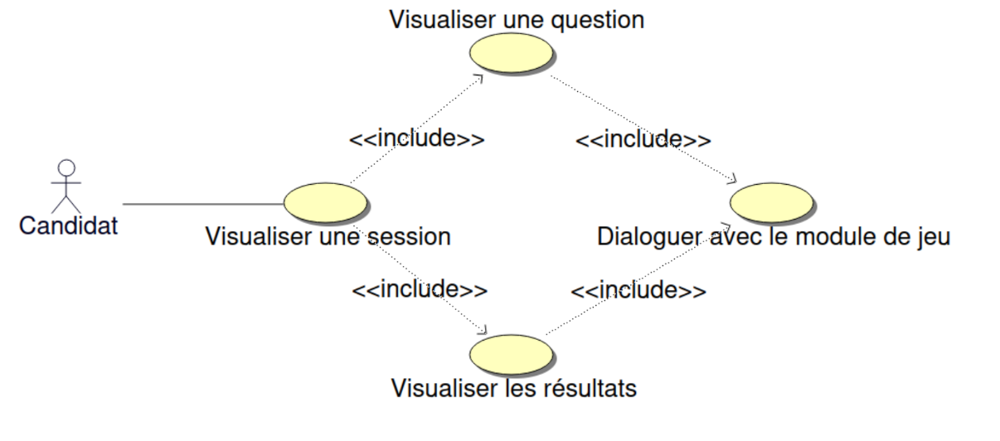
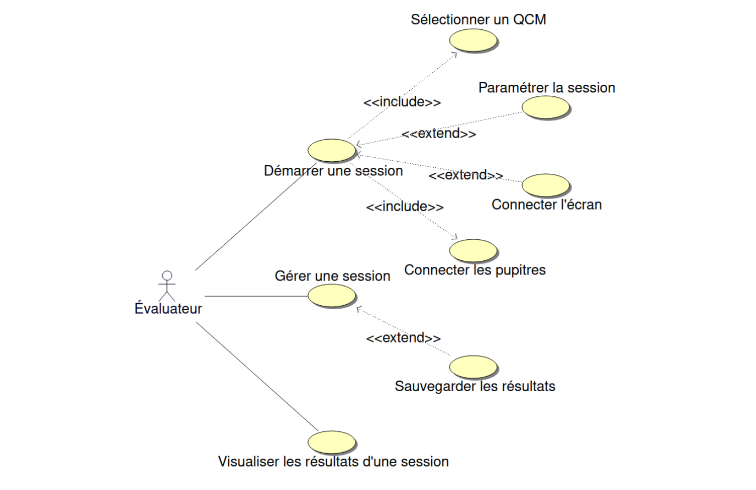

# Projet : Quizzy

- [Le projet quizzy](#projet--quizzy)
  - [Présentation](#présentation)
    - [Quizzy](#quizzy)
    - [Le module de visualisation](#le-module-de-visualisation)
    - [Le module de gestion](#le-module-de-gestion)
  - [Utilisation](#utilisation)
  - [Diaporamas de présentation](#diaporamas-de-présentation)
  - [Diagrammes de cas d'utilisation](#diagrammes-de-cas-dutilisation)
    - [Module de visualisation](#module-de-visualisation)
    - [Module de gestion](#module-de-gestion)
  - [Diagrammes de classes](#diagrammes-de-classes)
  - [Base de données](#base-de-données)
  - [Fonctionnalités](#fonctionnalités)
  - [Itérations](#itérations)
    - [Itération 1](#itération-1)
    - [Itération 2](#itération-2)
    - [Itération 3](#itération-3)
  - [Changelog](#changelog)
  - [TODO](#todo)
  - [Défauts constatés non corrigés](#défauts-constatés-non-corrigés)
  - [Équipe de développement](#équipe-de-développement)

---

## Présentation

### Quizzy

### Le module de visualisation

### Le module de gestion

---

## Utilisation

---

## Diaporamas de présentation

---

## Diagrammes de cas dutilisation 

### Module de visualisation



### Module de gestion



---

## Diagrammes de classes

- Module de visualisation

- Module de gestion

---

## Base de données

```sql
CREATE TABLE IF NOT EXISTS table_quiz(
    quizzID INTEGER PRIMARY KEY AUTOINCREMENT, 
    themeID INTEGER, 
    horodatage TEXT NOT NULL, 
    gagnantID INTEGER DEFAULT 0, 
    FOREIGN KEY (themeID) REFERENCES table_theme(themeID) ON DELETE CASCADE
);

CREATE TABLE IF NOT EXISTS table_resultats(
    quizzID INTEGER, 
    participantID INTEGER, 
    score REAL, 
    PRIMARY KEY (quizzID, participantID),
    FOREIGN KEY (quizzID) REFERENCES table_quiz(quizzID) ON DELETE CASCADE,
    FOREIGN KEY (participantID) REFERENCES table_participant(participantID) ON DELETE CASCADE
);

CREATE TABLE IF NOT EXISTS table_question(
    questionID INTEGER PRIMARY KEY AUTOINCREMENT,
    themeID INTEGER,
    question TEXT NOT NULL,
    proposition1 TEXT NOT NULL,
    proposition2 TEXT NOT NULL,
    proposition3 TEXT NOT NULL,
    proposition4 TEXT NOT NULL,
    explication TEXT DEFAULT '',
    reponse INTEGER NOT NULL,
    points	REAL DEFAULT 1,
    FOREIGN KEY (themeID) REFERENCES table_theme(themeID) ON DELETE CASCADE
);

CREATE TABLE IF NOT EXISTS table_reponse(
    quizzID INTEGER,
    participantID INTEGER,
    questionID INTEGER,
    temps INTEGER DEFAULT NULL,
    reponse INTEGER NOT NULL,
    PRIMARY KEY (quizzID, participantID, questionID),
    FOREIGN KEY (quizzID) REFERENCES table_quiz(quizzID) ON DELETE CASCADE,
    FOREIGN KEY (participantID) REFERENCES table_participant(participantID) ON DELETE CASCADE,
    FOREIGN KEY (questionID) REFERENCES table_question(questionID) ON DELETE CASCADE
);

CREATE TABLE IF NOT EXISTS table_participant(
    participantID INTEGER PRIMARY KEY AUTOINCREMENT,
    prenom TEXT NOT NULL
);

CREATE TABLE IF NOT EXISTS table_theme(
    themeID INTEGER PRIMARY KEY AUTOINCREMENT,
    theme TEXT NOT NULL
);
```

## Fonctionnalités

- Module de visualisation

| Fonctionalités                          | A faire | En cours | Terminé |
| --------------------------------------- | :-----: | :------: | :-----: |
| Visualiser une session                  |    O    |          |         |
| Visualiser une question                 |    O    |          |         |
| Visualiser les propositions             |    O    |          |         |
| Visualiser un compte à rebours          |    O    |          |         |
| Visualiser les résultats                |    O    |          |         |
| Dialoguer avec le module de gestion     |    O    |          |         |
| S'afficher en mode "kiosque"            |    O    |          |         |

- Module de gestion

| Fonctionalités                            | A faire | En cours | Terminé |
| ---------------------------------------   | :-----: | :------: | :-----: |
| Démarrer / stopper une session            |    O    |          |         |
| Sélectionner un thème                     |    O    |          |         |
| Dialoguer avec le module de visualisation |    O    |          |         |
| Dialoguer avec le module de jeu           |    O    |          |         |
| Gérer une session                         |    O    |          |         |
| Paramétrer la session                     |    O    |          |         |
| Sauvegarder les résultats                 |    O    |          |         |
| Visualiser un historique                  |    O    |          |         |

---

## Itérations

### Itération 1

- **Mise en place de la BDD** : la base de données est fonctionnelle
- **Envoyer des questions** : le module de gestion envoie des questions au module de visualisation
- **Envoyer des propositions** : le module de gestion envoie des propositions au module de visualisation
- **Afficher des questions** : le module de visualisation affiche les questions reçues
- **Afficher des propositions** : le module de visualisation affiche les propositions reçues

### Itération 2

- **Configurer une session** : l'utilisateur peut choisir le thème, le nombre de question et le temps pour répondre
- **Chronométrer** : les questions s'arrêtent à la fin du temps imparti
- **Afficher le chronomètre** : le temps pour répondre est affiché

### Itération 3

- **Sauvegarder les résultats** : les résultats sont enregistrés à la fin d'une session
- **Afficher l'historique** : l'utilisateur à la possibilité d'afficher l'historique
- **Mode kiosk** : l'affichage est configuré en mode kiosk

---

## Changelog

---

## TODO

---

## Défauts constatés non corrigés

---

## Équipe de développement

- ÉTUDIANT 1 : [RAFFIN Louis](https://github.com/LouisRaffin)
- ÉTUDIANT 2 : [GASSE Lenny](https://github.com/lgasse)

---

&copy; 2024-2025 LaSalle Avignon
