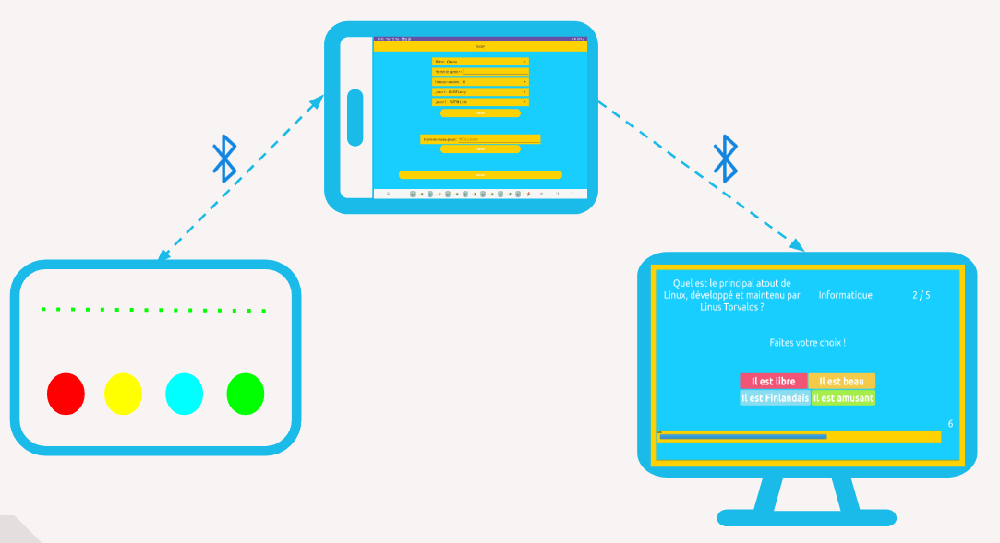
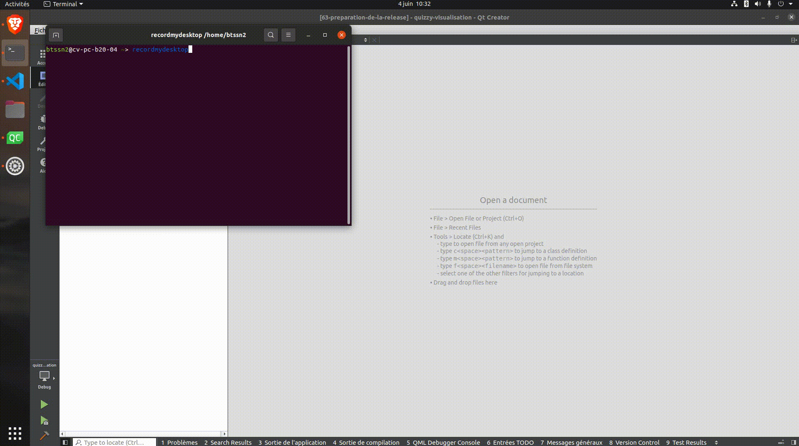
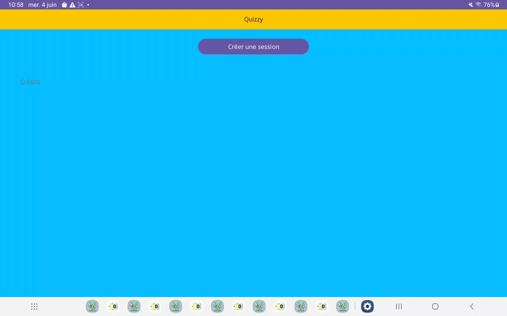
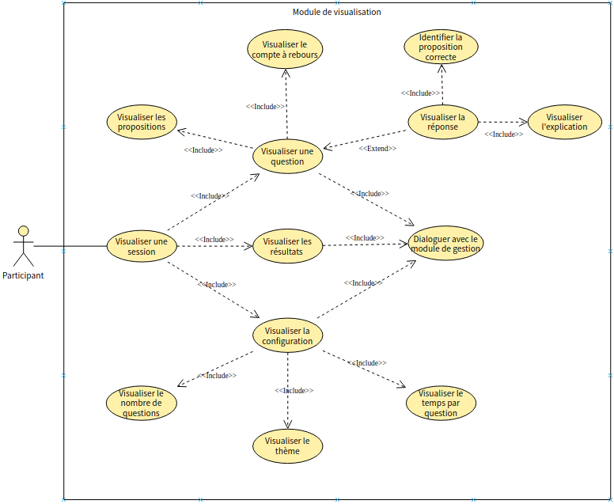
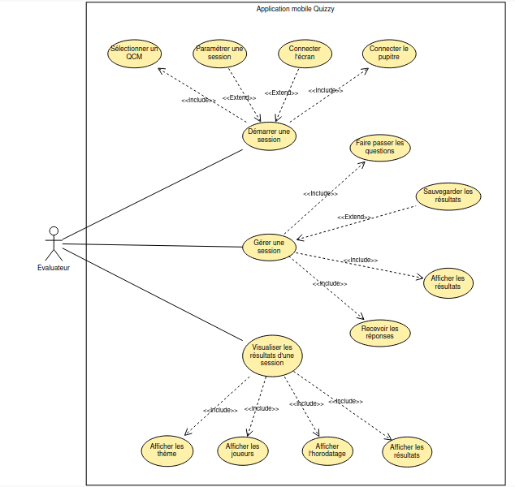
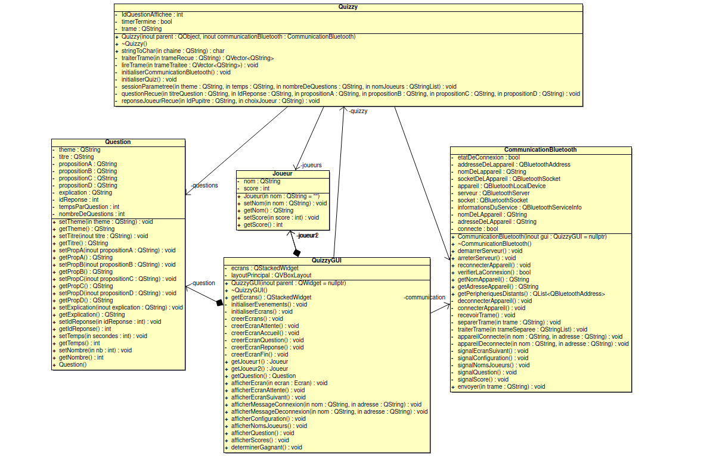
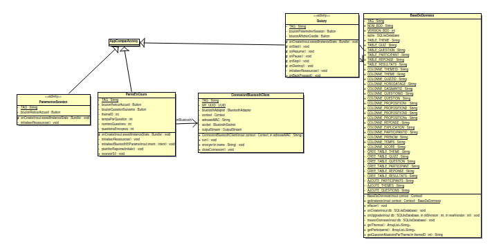
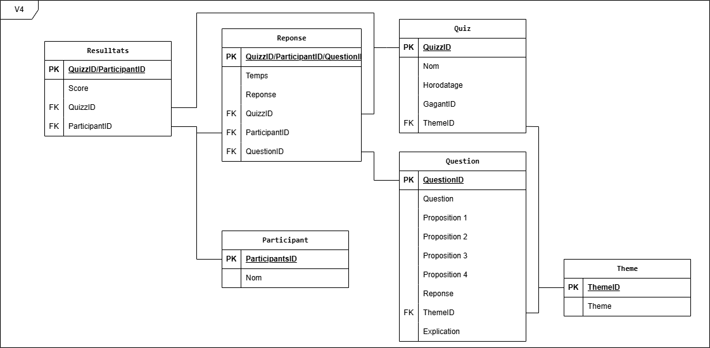
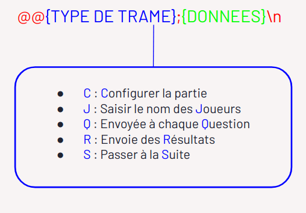
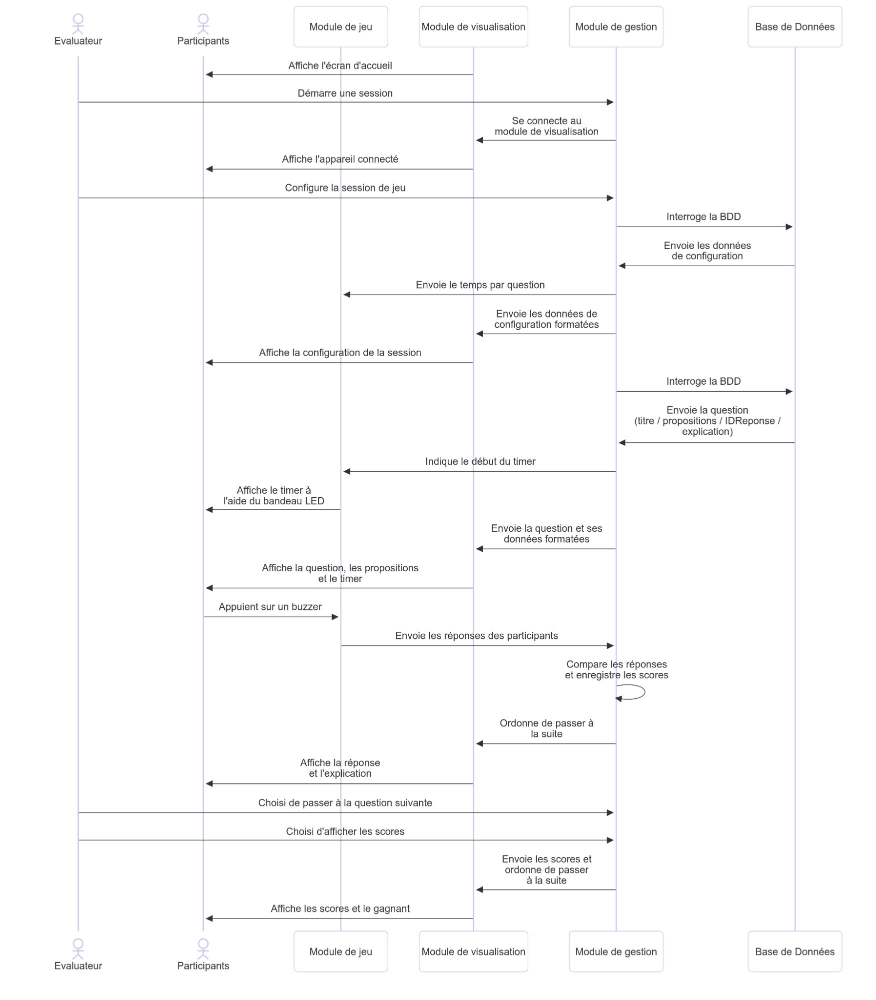

  

# Projet BTS CIEL 2025 : Quizzy

- [Projet BTS CIEL 2025 : Quizzy](#projet-bts-ciel-2025--quizzy)
  - [Présentation](#présentation)
  - [Fonctionnalités](#fonctionnalités)
  - [Diagrammes de cas d'utilisation](#diagrammes-de-cas-dutilisation)
  - [Diagrammes de classes](#diagrammes-de-classes)
  - [Base de données](#base-de-données)
  - [Protocole](#protocole)
  - [Gestion de projet](#gestion-de-projet)
    - [Itération 1](#itération-1)
    - [Itération 2](#itération-2)
    - [Itération 3](#itération-3)
    - [Itération 4](#itération-4)
  - [Changelog](#changelog)
    - [Version 1.0](#version-10)
  - [TODO](#todo)
    - [Version 1.1](#version-11)
  - [Défauts constatés non corrigés](#défauts-constatés-non-corrigés)
  - [Équipe de développement](#équipe-de-développement)

---

## Présentation

QUIZZY est un système numérique d'évaluation ludique sous forme de questionnaire à choix multiple (QCM) où une question est posée et la réponse est à choisir parmi un ensemble de propositions.

Il se pratique à plusieurs autour de plusieurs pupitres et d’un écran principal. Un pupitre est composé :

- 4 buzzers (bouton poussoir de type arcade)
- un bandeau leds multicolores
- un écran (en option)

L’évaluateur dispose d’une tablette permettant d’assurer la session d’évaluation.

Le système QUIZZY est décomposé en trois modules :

- Module de gestion de quiz (Tablette-QUIZZY)
- Module de jeu (Pupitre-QUIZZY)
- Module de visualisation (Écran-QUIZZY)

Les modules communiquent via le Bluetooth :

## Fonctionnalités

- Module de visualisation (Qt/Raspberry Pi)

| Fonctionalités                          | A faire | En cours | Terminé |
| --------------------------------------- | :-----: | :------: | :-----: |
| Visualiser une session                  |         |          |    O    |
| Visualiser une question                 |         |          |    O    |
| Visualiser les propositions             |         |          |    O    |
| Visualiser un compte à rebours          |         |          |    O    |
| Visualiser les résultats                |         |          |    O    |
| Dialoguer avec le module de gestion     |         |          |    O    |
| S'afficher en mode "kiosque"            |         |          |    O    |

- Module de gestion (Java/Android)

| Fonctionalités                            | A faire | En cours | Terminé |
| ---------------------------------------   | :-----: | :------: | :-----: |
| Démarrer / stopper une session            |         |          |    O    |
| Sélectionner un thème                     |         |          |    O    |
| Dialoguer avec le module de visualisation |         |          |    O    |
| Dialoguer avec le module de jeu           |         |          |    O    |
| Gérer une session                         |         |          |    O    |
| Paramétrer la session                     |         |          |    O    |
| Sauvegarder les résultats                 |         |    O     |         |
| Visualiser un historique                  |         |    O     |         |

## Diagrammes de cas d'utilisation

- Module de visualisation

- Module de gestion

## Diagrammes de classes

- Module de visualisation

- Module de gestion

## Base de données

cf. [ldd.sql](./bdd/ldd.sql)

## Protocole

## Gestion de projet

[GitHub Project](https://github.com/orgs/bts-lasalle-avignon-projets/projects/25)

### Itération 1

Du 29 Janvier au 28 Mars

- **Mise en place de la BDD** : la base de données est fonctionnelle
- **Envoyer des questions** : le module de gestion envoie des questions au module de visualisation
- **Envoyer des propositions** : le module de gestion envoie des propositions au module de visualisation
- **Recevoir** : le module de visualisation reçoit et traite les trames
- **Afficher des questions** : le module de visualisation affiche les questions reçues
- **Afficher des propositions** : le module de visualisation affiche les propositions reçues

### Itération 2

Du 29 Mars au 23 Mai

- **Configurer une session** : l'utilisateur peut choisir le thème, le nombre de question et le temps pour répondre
- **Chronométrer** : les questions s'arrêtent à la fin du temps imparti
- **Afficher le chronomètre** : le temps pour répondre est affiché
- **Afficher la réponse** : la réponse est affichée une fois le temps écoulé

### Itération 3

Du 24 Mai au 30 Mai

- **Sauvegarder les résultats** : les résultats sont enregistrés à la fin d'une session
- **Afficher l'historique** : l'utilisateur à la possibilité d'afficher l'historique
- **Afficher les scores** : les scores sont affichés
- **Mode kiosk** : l'affichage est configuré en mode kiosk

### Itération 4

Du 31 Mai au 15 Juin

- **Amélioration de l'affichage** : l'interface utilisateur est plus claire et intuitive
- **Recommencer des parties** : possibilité de relancer une partie

## Changelog

### Version 1.0

- [x] Dialoguer entre les modules gestion / visualisation
- [x] Configurer une session
- [x] Gérer le déroulement d'une session
- [x] Visualiser une session
- [x] Chronométrer les questions
- [x] Visualiser les scores

## TODO

### Version 1.1

- [ ] Dialoguer avec le module de jeu
- [ ] Recommencer des parties
- [ ] Enregistrer les scores
- [ ] Afficher un historique

## Défauts constatés non corrigés

Certaines questions peuvent se répéter au sein d'une même session de jeu.

## Équipe de développement

- Module de visualisation (Qt/RPI) : [RAFFIN Louis](https://github.com/LouisRaffin)
- Module de gestion de quiz (Java/android) : [GASSE Lenny](https://github.com/lgasse)

---

&copy; 2024-2025 LaSalle Avignon
